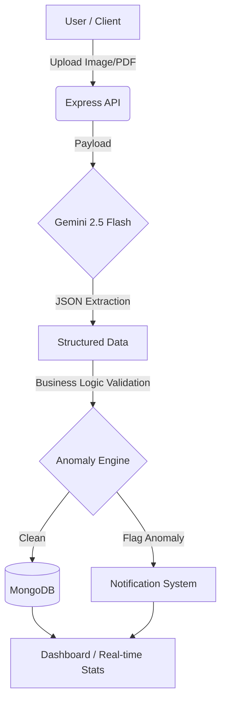

# Profit Lens Core

**Enterprise-Grade Financial Intelligence Engine powered by Google Gemini 2.5 Flash.**

Automated OCR Extraction, Real-time Margin Tracking, and Intelligent Anomaly Detection.

---

## Overview

Profit Lens Core is a sophisticated full-stack financial tool designed to eliminate the manual overhead of accounting. By leveraging LLM-based OCR (Google Gemini 2.5 Flash), the system transforms raw invoice images and PDF data into structured, actionable financial insights with high precision.

### Why this project?
Traditional accounting software often relies on rigid, template-based OCR that fails when invoice layouts change. Profit Lens Core uses a semantic approach, understanding the *context* of a document to extract data regardless of formatting, while simultaneously validating business logic (VAT consistency, NIP verification, category classification).

## Technical Architecture

The system follows a modern MERN architecture (MongoDB, Express, React, Node) with a heavy focus on asynchronous processing and AI-driven validation.



### Technical Highlights
- AI Engine: Prompt Engineering for zero-shot data extraction with enforced JSON Schema.
- Frontend Architecture: React 19 with a mobile-first, "Sticky Action" design pattern.
- Performance: Multer memory-based buffering for rapid AI handshakes.
- UX/UI: Glassmorphic design system using Tailwind 4.0 and Framer Motion for micro-interactions.
- DevOps: Containerized with Docker for seamless environment synchronization.

## Key Features

- Semantic OCR Extraction: Automatically pulls Vendor Name, Date, NIP, Net/Gross, and Category using Gemini's vision-to-json capabilities.
- Intelligent Anomaly Detection:
    - Flags VAT discrepancies (e.g., Net + 23% != Gross).
    - Identifies missing identifiers (NIP/Tax IDs).
    - Detects duplicate entries and classification errors.
- Financial Analytics: Real-time margin tracking and expense distribution visualizations.
- Multi-Device Support: Fully responsive interface featuring "Sticky Footer" actions for mobile productivity.
- Accounting Export: Batch processing and CSV export ready for integration with professional accounting software.

## System Requirements and Setup

### Prerequisites
- Node.js: v20+ (Long Term Support)
- Docker: (Optional but recommended for MongoDB/zero-config)
- Google AI Studio API Key: For Gemini 2.5 Flash access.

### Quick Start (Docker)
```bash
# Clone and Launch everything (DB, API, Client)
git clone https://github.com/yourusername/profit-lens-core.git
cd profit-lens-core
docker-compose up --build
```
*Access the app at http://localhost:80*

### Manual Development Setup
1. Install Dependencies: npm install (root, client, server).
2. Environment: Create server/.env with MONGO_URI and GEMINI_API_KEY.
3. Launch: npm run dev.

## Roadmap and Recruitment Notes
This project was built to demonstrate:
1. Integration of LLMs into production workflows beyond simple chatbots.
2. Full-stack proficiency with modern libraries (React 19, Tailwind 4).
3. Handling of sensitive data and building robust validation layers.
4. DevOps mindset via Dockerization and structured CI/CD preparation.

---

## Contributing and License
Distributed under the MIT License. See [CONTRIBUTING.md](CONTRIBUTING.md) for how to get involved.

Built for the Open Source Community.
